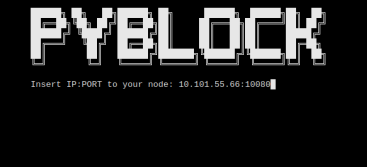
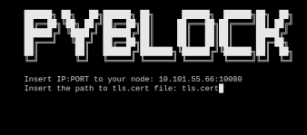

   
    ----------------------
    CPU Usage: X% 
    Memory Usage: X% 
    ----------------------
	
    Local: PyBLOCK
    Node:  XxXxXxX
    Block: XxXxXxX
    Version: X.x.X
    
    A. PyBLOCK
    B. Bitcoin Core
    L. Lightning Network
    P. Platforms
    S. Settings
    X. Donate
    Q. Exit
    
    Select option:     

 

 

 

 

 

 

 

 

 

 

 

 

 

# PyBLOCK
ℙ𝕪𝔹𝕃𝕆ℂ𝕂 𝕚𝕥𝕤 𝕒 𝔹𝕚𝕥𝕔𝕠𝕚𝕟 𝔻𝕒𝕤𝕙𝕓𝕠𝕒𝕣𝕕 𝕨𝕚𝕥𝕙 ℂ𝕪𝕡𝕙𝕖𝕣𝕡𝕦𝕟𝕜 𝕒𝕖𝕤𝕥𝕙𝕖𝕥𝕚𝕔.

- This will fully work on a Node that has Bitcoin Core and LND installed.
- We fully tested and worked perfect on [MyNodeBTC](https://twitter.com/_PyBlock_/status/1402516068959199233)
- We fully tested and worked perfect on [RaspiBlitz](https://twitter.com/_PyBlock_/status/1405788110458441728)
- We fully tested and worked perfect on [BitcoinMachines](https://twitter.com/_PyBlock_/status/1365757861217861632)
- We fully tested and worked perfect on [Umbrel](https://twitter.com/_PyBlock_/status/1405574038320201733)

# First Start

- You will need to find the path of the files tls.cert and admin.macaroon to do the REST connection to have access to LND.
- [Poetry](https://python-poetry.org/) is needed to ensure every user has the same python dependencies installed.

    ### From LOCAL Node

    Open the Terminal.

    -- Easy mode:
    * a@A:~> sudo apt install hexyl
    * a@A:~> sudo apt install jq
    * a@A:~> pip3 install pybitblock
    * a@A:~> pyblock
    
    -- Manual mode:
    * a@A:~> sudo apt install hexyl
    * a@A:~> sudo apt install jq
    * a@A:~> git clone https://github.com/curly60e/pyblock.git
    * a@A:~> cd pyblock
    * a@A:~> pip3 install -r requirements.txt
    * a@A:~> cd pybitblock
    * a@A:~> python3 PyBlock.py

    -- Poetry mode:
    * a@A:~> sudo apt install hexyl
    * a@A:~> sudo apt install jq
    * a@A:~> pip3 install poetry
    * a@A:~> git clone https://github.com/curly60e/pyblock.git
    * a@A:~> cd pyblock
    * a@A:~> poetry install
    * a@A:~> cd pybitblock
    * a@A:~> poetry run python3 PyBlock.py

    -- Upgrade:
    * a@A:~> pip3 install pybitblock -U
    * a@A:~> pyblock

     

    - This is how we continue.

     

    

     

    - It will ask you for the IP:PORT (REST PORT) in this case use: localhost instead of the IP.

     

    

     

    - Then it will ask you for the path to the tls.cert.

     

    

     

    - Then it will ask you for the path to the admin.macaroon.

     

    

       

    - Then it will ask you for the path to bitcoin-cli or if you have already installed just put: bitcoin-cli.

     

    

     

    - And you are in.

     

    

     

    ### From REMOTE Computer

    * You will need to have tls.cert and admin.macaroon already downloaded from your LND node.
    * [Poetry](https://python-poetry.org/) is needed to ensure every user has the same python dependencies installed.

     Open the Terminal.

    -- Easy mode:
    * a@A:~> sudo apt install hexyl
    * a@A:~> sudo apt install jq
    * a@A:~> pip3 install pybitblock
    * a@A:~> pyblock
    
    -- Manual mode:
    * a@A:~> sudo apt install hexyl
    * a@A:~> sudo apt install jq
    * a@A:~> git clone https://github.com/curly60e/pyblock.git
    * a@A:~> cd pyblock
    * a@A:~> pip3 install -r requirements.txt
    * a@A:~> cd pybitblock
    * a@A:~> python3 PyBlock.py

    -- Poetry mode:
    * a@A:~> sudo apt install hexyl
    * a@A:~> sudo apt install jq
    * a@A:~> pip3 install poetry
    * a@A:~> git clone https://github.com/curly60e/pyblock.git
    * a@A:~> cd pyblock
    * a@A:~> poetry install
    * a@A:~> cd pybitblock
    * a@A:~> poetry run python3 PyBlock.py

    -- Upgrade:
    * a@A:~> pip3 install pybitblock -U
    * a@A:~> pyblock

         

        - This is how we continue.

         

        

         

        - It will ask you for the IP:PORT (REST PORT).

         

        

         

        - Then it will ask you for the path to the tls.cert.

         

        

         

        - Then it will ask you for the path to the admin.macaroon.

         

        

           

        - Then it will ask you for the path to bitcoin-cli or if you have already installed just put: bitcoin-cli.

         

        

         

        - And you are in.

         

        

         

## Dependencies

  - Install Curl on Debian based type:
    - sudo apt install curl

## How to execute

  - python3 PyBlock.py
  
  
## Running PyBLOCK using Docker

First check out or [unzip](https://github.com/curly60e/pyblock/archive/refs/heads/master.zip) the code to a directory, cd to that directory, and from there type the following commands: 
(Make sure Docker desktop is running in the background "sudo service docker start".)

  - docker build -t pyblock .
  
Run it using

  - docker run -p 6969:6969 -it pyblock
  
Then open http://localhost:6969 with a browser, you will get the PyBLOCK Docker App.

Credentials: "Running:PyBLOCK" ("User:Pass")

### Created by

[@Curly60e.](https://twitter.com/curly60e) ⚡️ curly60e@zbd.gg

npub1a78zk8cnczxjudg888f9t3va29vxhevvhdkdqvwe7zk70qx488zsc8573s

### Pentester and contribution by

[@SN.](https://twitter.com/__B__T__C__) ⚡️ sn@getalby.com

npub1h0mlskkqsyct98tldn744wa5j783h8du779c7zdjay29uyzwev4qxx9sjn

### Contributor

[@Danvergara.](https://twitter.com/__danvergara__)

### Tools by

[@SamouraiDev,](https://twitter.com/SamouraiDev)
[@Korynewton,](https://twitter.com/kn3wt)
[@Tippin_Me,](https://twitter.com/tippin_me)
[@TallyCoinApp,](https://twitter.com/tallycoinapp)
[@DJBooth007,](https://twitter.com/djbooth007)
[@MemPool,](https://twitter.com/mempool)
[@CoinGecko,](https://twitter.com/coingecko)
[@Igor_Chubin,](https://twitter.com/igor_chubin)
[@Shesek,](https://twitter.com/shesek)
[@LNBits,](https://twitter.com/lnbits)
[@LNPAYco,](https://twitter.com/LNPAYco)
[@OpenNodeCo,](https://twitter.com/OpenNodeCo)
[@BlockStream,](https://twitter.com/Blockstream)
[@Gwidion,](https://twitter.com/gwidion)
[@AlphaaZeta,](https://twitter.com/alphaazeta)
[@Hampus_S,](https://twitter.com/hampus_s)
[@Mutatrum,](https://twitter.com/mutatrum)
[@RoboHash,](https://twitter.com/Robohash)
[@C_Otto83,](https://twitter.com/c_otto83)
[@BashCo_,](https://twitter.com/BashCo_)
[@JamesOb,](https://twitter.com/jamesob)
[@BenTheCarman,](https://twitter.com/benthecarman)
[@Whale_Alert,](https://twitter.com/whale_alert)
[@BitcoinExplorer,](https://twitter.com/BitcoinExplorer)
[@JanoSide,](https://twitter.com/janoside)
[@LNstats,](https://twitter.com/LNstats)
[@Slush_Pool,](https://twitter.com/slush_pool)
[@Braiins_Systems,](https://twitter.com/braiins_systems)
[@CKPoolDev,](https://twitter.com/ckpooldev)
[@KanoBTC,](https://twitter.com/kanobtc)
[@JohnCantrell97,](https://twitter.com/JohnCantrell97)
[@JoostJgr,](https://twitter.com/joostjgr)
[@PRguitarman,](https://twitter.com/PRguitarman)
[@NyanCat,](https://twitter.com/nyannyancat)
[@Mononautical,](https://twitter.com/mononautical)
[@Janna3257,](https://twitter.com/Janna3257)
[@Cercatrova_21,](https://twitter.com/cercatrova_21)
[@ChaumDotCom,](https://twitter.com/chaumdotcom)
[@CashuBTC,](https://twitter.com/CashuBTC)
[@CalleBTC,](https://twitter.com/callebtc)
[@0xB10C,](https://twitter.com/0xB10C)
[@BitRawr,](https://twitter.com/bitrawr)
[@Vishalxl,](https://twitter.com/vishalxl)
[@Odudex,](https://twitter.com/odudex)
[@UTXOracle,](https://twitter.com/UTXOracle)
[@Acinq,](https://twitter.com/acinq_co)
[@PhoenixWallet,](https://twitter.com/PhoenixWallet)
[@ForemanMining,](https://twitter.com/foremanmining)
[@@Ocean_Mining,](https://twitter.com/Ocean_Mining)
[@LuxorTechnology,](https://twitter.com/LuxorTechnology)
[@PyPi,](https://pypi.org/project/pybitblock/)
...

 

## PyBLØCK SOLO MINING POOL

Are you a Bitcoin Miner? 

stratum+tcp://pool.pyblock.xyz:3333

Note that if you do not find a Block, you get no reward at all with Solo Mining.

0.4 % goes to PyBLØCK to operate the Pool.

 

## [Click here for more info](https://t.me/pyblockpool)

 

## [PyBLOCK POOL WEBSITE](https://pool.pyblock.xyz)

 

## PyBLOCK BOLT12

 

## SUPPORT PyBLØCK.

⚡️ curly60e@zbd.gg ⚡️

Bitcoin Address: bc1prwjajvvax2rkm2wzelpfzzc2ncywht69pswnurhzdfj9qujhyxzsqpd3eg

Samourai Wallet Paynym: PM8TJhNTTq3YVocXuPtLjKx7pKkdUxqwTerWJ2j2a7dNitgyMmBPN6gK61yE17N2vgvQvKYokXktt6D6GZFTmocvDJhaUJfHt7ehEMmthjsT3NQHseFM

Monero: 42jtb4dAfm6BQ8h6x56qGyAMMHVXGRwRMTSb2LwsBg1jVqD4TxfpD1pTK56tkrTMGhEKipZdDHfJrB1g8iQfvSyC7gZ9M8M

PyBLØCK [Nostr Pulic Channel](https://anigma.io/?channel=ddadf6518d23d5e82a112b7965807ea2adfb22ec353a124fbf5f342e8403fdcb)
