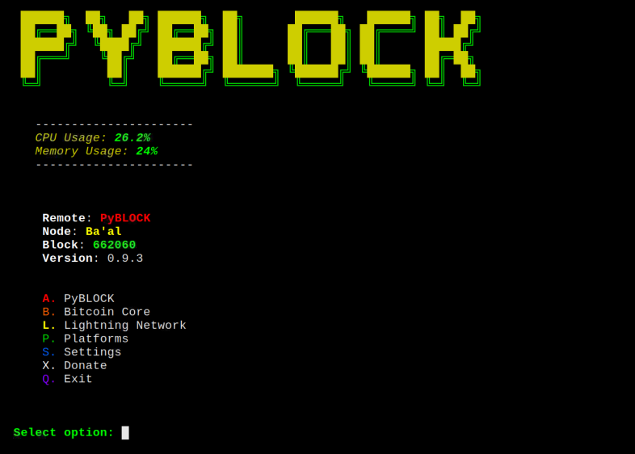
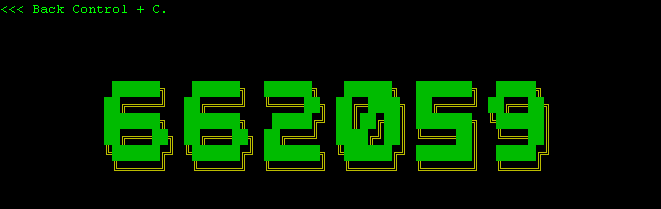
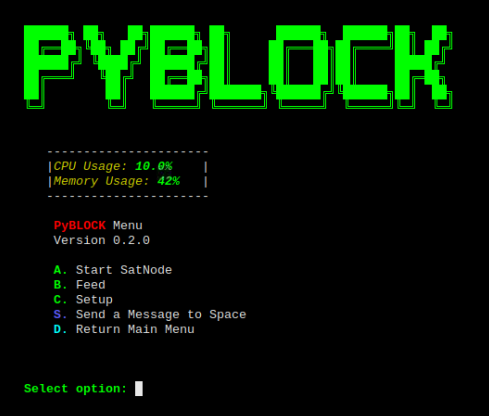
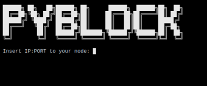
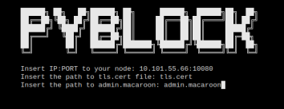

 

 

 

 

 

 

# PyBlock v0.9.8
Dashboard Bitcoin information program

A simple Python Block Clock to check the Blockchain information.

- This will fully work on a node that has Bitcoin Core and LND installed
- We fully tested and worked perfect on [MyNodeBTC](https://mynodebtc.com/)

## First Start

- You will need to find the path of the files tls.cert and admin.macaroon to do the REST connection to have access to LND.

    ### From local node

    Open the Terminal

    - Type these commands:

    * a@A:~> git clone https://github.com/curly60e/pyblock.git
    * a@A:~> cd pyblock
    * a@A:~> pip3 install -r requirements.txt
    * a@A:~> python3 PyBlock.py

     

    - This is how we continue.

     

    

     

    - It will ask you for the IP:PORT (REST PORT) in this case use: localhost instead of the IP.

     

    

     

    - Then it will ask you for the path to the tls.cert.

     

    

     

    - Then it will ask you for the path to the admin.macaroon.

     

    

       

    - Then it will ask you for the path to bitcoin-cli or if you have already installed just put: bitcoin-cli.

     

    

     

    - And you are in.

     

    

     

    ### From remote computer with Bitcoin Core installed

    * You will need to have tls.cert and admin.macaroon already downloaded from your LND node.

     - Open the Terminal.

     - Type these commands:

        * a@A:~> git clone https://github.com/curly60e/pyblock.git
        * a@A:~> cd pyblock
        * a@A:~> pip3 install -r requirements.txt
        * a@A:~> python3 PyBlock.py

         

        - This is how we continue.

         

        

         

        - It will ask you for the IP:PORT (REST PORT).

         

        

         

        - Then it will ask you for the path to the tls.cert.

         

        

         

        - Then it will ask you for the path to the admin.macaroon.

         

        

           

        - Then it will ask you for the path to bitcoin-cli or if you have already installed just put: bitcoin-cli.

         

        

         

        - And you are in.

         

        

         

## Dependencies

  - Install [Hexyl](https://github.com/sharkdp/hexyl)
  - Install Curl on Debian based type:
    - sudo apt install curl

## How to execute

  - python3 PyBlock.py

## How make it work
  It will appear a place you can put your Bitcoin-cli path

  - "Path to your Bitcoin-cli: " #Add the path and shoot Enter.
  - Install Tor & TELNET on Debian based type [ONLY FOR HACKER ZONE CONNECTION]:
    - sudo apt install tor
      * To activate Tor on the shell type:
        - source torsocks on
    - sudo apt install telnet
      * After this you can execute PyBlock and connect to the HACKER ZONE.

### Contributors

[@Curly60e](https://twitter.com/royalfield370)
[@SamouraiDev](https://twitter.com/SamouraiDev)
[@Korynewton](https://github.com/korynewton)
[@Joao S. O. Bueno](https://github.com/jsbueno/terminal_matrix)
[@C-Otto](https://github.com/C-Otto/rebalance-lnd)
@Tippin_Me
@TallyCoinApp
@MemPool
@CoinGecko
@Igor_Chubin
@Shesek
@LNBits
@LNPAYco
@OpenNodeCo
@BlockStream
@Gwidion
@AlphaaZeta
@Hampus_S
@Mutatrum
@RoboHash
@C_Otto83
@BashCo_
@JamesOb
@BenTheCarman

### Testers

[@__B__T__C__](https://twitter.com/__B__T__C__)

DONATE PYBLOCK

Bitcoin Address: bc1qjzaz34nv2ev55vfdu9m5qh0zq0fwcn6c7pkcrv

Samourai Wallet Paynym: PM8TJhNTTq3YVocXuPtLjKx7pKkdUxqwTerWJ2j2a7dNitgyMmBPN6gK61yE17N2vgvQvKYokXktt6D6GZFTmocvDJhaUJfHt7ehEMmthjsT3NQHseFM

Lightning KeySend: 02d22df3b3013af15a2da1381bdd76266a9375040a5152b67999ad32a26e6b8a88

Monero: 42jtb4dAfm6BQ8h6x56qGyAMMHVXGRwRMTSb2LwsBg1jVqD4TxfpD1pTK56tkrTMGhEKipZdDHfJrB1g8iQfvSyC7gZ9M8M

